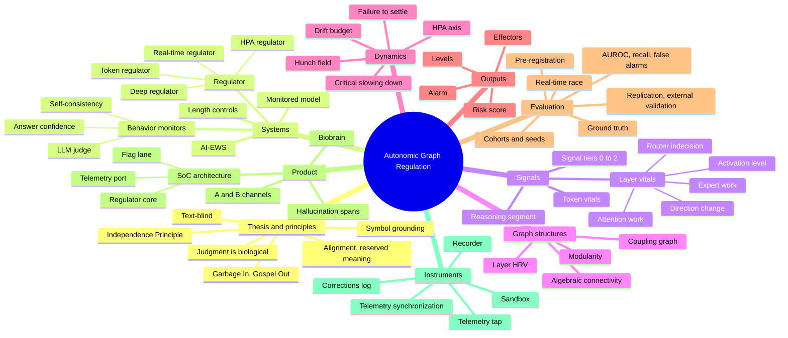

# AGR Program — Ontology and Glossary (v0.2)

*Purpose: one vocabulary for the author, collaborators and AI researchers. Every term used in the repository, reports and
conversations is defined here in plain English, technically, and mathematically where it applies.*

**Naming status (2026-09-30):** the author has **accepted** the renames and definitions in Part 3. They will be applied
across the repository **after** the YB-0035 findings are in, so that the corrected results and the new vocabulary land
together. Until then, documents keep the current names.

**Interactive version:** the AGR ontology explorer (collapsible branches, search, and each term's plain-English,
technical and math definitions): https://claude.ai/artifact/Xjd39j9prLc5znkwmKuMko

**Status tags**
- **[STD]** a standard term used with its established field meaning.
- **[PGM]** a term coined or specialised in this program.
- **[COLLISION]** the same word is used for two different things; a rename is proposed.
- **[RENAME?]** the term works but a clearer name is suggested.
- **[AVOID]** informal or overloaded; use the suggested replacement in formal writing.

---

## Part 1 — Ontology (how the concepts relate)

The mind map uses the **accepted new names** (applied repository-wide after the findings). Current names in use:
regulator = organism; monitored model = patient; telemetry synchronization = tap alignment.

---

## Part 2 — Glossary

### A. Thesis and principles

**Alignment (AI alignment)** [STD] — *reserved meaning*
- *Plain English:* whether an AI system behaves in accordance with human-defined safety concepts, values and rules.
- *Technical:* the degree to which a system's objectives and behavior match the intentions and constraints specified
  by its developers and users. In this program the word is **reserved for this meaning only**.
- *Note:* the program currently monitors **errors** (wrong answers), which is a reliability property, not alignment
  in this sense. Detecting misaligned intent (e.g. deception) is not yet tested (see *Symbol grounding*).

**Garbage In, Gospel Out** [PGM]
- *Plain English:* language models produce fluent, confident text whether they are right or wrong, so their output
  always *sounds* like gospel.
- *Technical:* output-level confidence is uncalibrated with respect to correctness. Measured: answer-token confidence
  scored AUROC 0.366 [0.304, 0.433] for detecting wrong answers (YB-0031), i.e. **inverted** (wrong answers were more confident).

**Judgment** [PGM]
- *Plain English:* the capacity to weigh many signals and decide well. The author's position: there is no working
  model of judgment other than the human brain and biology; an algorithm inside a transformer cannot create it.
- *Technical:* in this program, "judgment" is modelled as a graded decision emerging from many dynamically weighted
  signals (see *Hunch field*), never as a transformer's self-evaluation.

**Independence Principle** [PGM]
- *Plain English:* never ask the defendant to be the judge. The safety system must be separate from the AI it watches.
- *Technical:* the regulator (1) is not a transformer and contains none, (2) never consumes the model's text or
  self-report (**text-blind**), (3) receives only numeric telemetry, and (4) acts through effectors.

**Text-blind** [PGM]
- *Plain English:* the regulator never reads words, only numbers.
- *Technical:* the regulator's input space contains no tokens or strings: numeric features of the patient's internal
  state and timing, plus the task category and elapsed token count used for normalization (third audit M5). *Claim status:* text-blindness is by construction. "Unjailbreakable" is **not** claimed
  (untested; audit F23).

**Interoception** [STD]
- *Plain English:* the body's sense of its own internal state (heartbeat, breathing, hunger).
- *Technical:* sensing and integrating internal physiological signals; here, reading the patient's internal
  activations and probabilities.

**Symbol grounding problem** [STD]
- *Plain English:* a simple, innate system cannot directly recognise abstract ideas that a learning system invented.
- *Technical:* the difficulty of mapping learned internal representations to fixed, innate evaluators. For this
  program: a text-blind regulator can detect **strain and error**, but detecting **intent** requires additional
  grounding (the B channel). Source of the framing: Byrnes (Astera Institute).

---

### B. Systems

**Patient** [PGM] — *proposed formal name: "monitored model"*
- *Plain English:* the AI being watched.
- *Technical:* the transformer whose internal state is recorded. Current: gpt-oss-20b (MLX, 24 layers, 32 experts per
  layer, greedy decoding). Next: Qwen3-VL-30B-A3B (48 layers, 128 experts).

**Organism** [PGM] — *proposed formal name: "regulator"*
- *Plain English:* the external "nervous system" that reads the patient's vital signs and raises warnings.
- *Technical:* a deterministic, text-blind scoring function s: features → [0, 1] (risk), plus thresholds and
  effectors. Variants: token, deep, serial/real-time, HPA (see Part 1).

**Deep organism** [PGM]
- *Technical:* an L2-regularised logistic model (C = 0.1) over 314 features from 24-layer telemetry: per-layer mean
  and RMSSD for 5 channels (240 features) plus two layer coupling graphs (74 features). *Correction:* earlier reports
  said "≈302" (audit F12).

**Real-time organism** [PGM] (YB-0033 onward)
- *Technical:* the deep organism computed on the first t tokens at checkpoints t ∈ {48, 96, 192, 384}, plus log t,
  normalised per (question type, t), trained on all derivation observations at those checkpoints. Uses no information
  about the total reasoning length.

**HPA organism** [PGM]
- *Plain English:* a model of the body's stress-hormone loop, used as a smoothed stress signal.
- *Math:* inhibitory feedback f(C) = 1 / (1 + (C/Kᵢ)ⁿ);
  dH/dt = b + k₁·S·f(C) − w₁·H;  dA/dt = k₂·H·f(C) − w₂·A;  dC/dt = k₃·A − w₃·C,
  with drive S ≥ 0 (H ≈ CRH, A ≈ ACTH, C ≈ cortisol). Proved: positivity, boundedness, a unique equilibrium for
  constant S (YB-0017).

**Behavior monitor** [PGM]
- *Plain English:* any monitor that judges the AI by what it says or does.
- *Technical:* monitors that consume the patient's text or outputs: **LLM judge** (gpt-oss-120b reads the question
  and reasoning, outputs P(wrong)), **self-consistency** (re-sample the patient and check agreement), **answer
  confidence** (1 − min top-1 probability over answer tokens).

**Control (length control)** [PGM]
- *Plain English:* a deliberately dumb monitor that only knows how long the AI has been thinking. If our organism can't
  beat it, the organism isn't reading anything deeper than length.
- *Math:* C1(t) = t (still reasoning at token t); C2(t) = the derivation-cohort percentile of t among episodes of the
  same question type.

**AI-EWS (AI Early Warning Score)** [PGM]
- *Plain English:* the hospital-style score: each vital sign earns 0–3 points by how far it is outside the model's own
  normal range; points add up to a level.
- *Math:* for vital j with risky direction dⱼ ∈ {+1, −1} and bands (b₁ⱼ, b₂ⱼ, b₃ⱼ) at the 90/95/99th (or 10/5/1st)
  percentiles of healthy episodes: pⱼ(x) = #{k : dⱼ·xⱼ > dⱼ·bₖⱼ} ∈ {0, 1, 2, 3}; score S = Σⱼ pⱼ ∈ [0, 3·J]
  (J = 7 in v1, 8 in v2). Red flag: any pⱼ = 3. Levels: urgent S ≥ 10, concern 7–9, watch 5–6 or red flag, else stable.
  Proved: bounded, monotone in each vital, fully explainable per point.
- *Versions:* v1 (7 vitals, YB-0030); v2 (+V8 failure to settle, YB-0031); v3 (bands per reasoning stage, YB-0032);
  v4 (bands per absolute checkpoint, YB-0033).

**NEWS2** [STD]
- *Plain English:* the UK hospital early-warning score that turns vital signs into points and a risk level; the
  template for AI-EWS.

**Biobrain** [PGM]
- *Plain English:* the regulator built as hardware.
- *Technical:* a separate signalling subsystem, on the same chip as the AI accelerator (system-on-chip) or beside it,
  that reads a one-way telemetry stream and outputs risk on a separate flag lane.

**SoC architecture / virtual SoC** [PGM]
- *Technical:* telemetry port (read-only taps on residual stream, experts, router, logits) → internal signal bus
  (120 values per token for gpt-oss-20b) → organism core (own clock and memory) → flag lane (risk per token, level
  per span). The current Mac setup is a software simulation of this ("virtual SoC").

**A channel / B channel** [PGM]
- *A:* the coupled physiological link (internal telemetry). *B:* a parallel appraisal of the same situation with a
  dissimilar architecture (context, task risk), never reading the patient's internals.

**Hunch field** [PGM] (YB-0027, not yet built)
- *Plain English:* many signals, each with a weight that changes by how trustworthy it currently is, settle into a
  graded hunch rather than a yes/no.
- *Math:* vote weights wᵢ(t) ∝ 1/σᵢ²(t); plastic edges W ← (1 − λ)·W + η·xᵢxⱼ under a drift budget; state
  τ·dz/dt = −z + φ(g(C)·W(t)·z + Σᵢ wᵢxᵢ); hunch h(t) = σ(readout(z)) ∈ [0, 1]. Stability if g·‖W‖₂·Lip(φ) < 1.

---

### C. Signals and vital signs

**Vital sign** [PGM] — *proposed formal name: "telemetry channel" or "vital"*
- *Plain English:* one number describing the AI's internal state at one moment.
- *Technical:* a scalar computed per generated token from the patient's internals.

**Signal tiers** [PGM]
- Tier 0 physical (latency, GPU power); Tier 1 consequence (effects in an environment); Tier 2 substrate (logits,
  activations); excluded: words and self-reports. Ranked by independence from the model's own statistics.

**Token vitals** [PGM]
- *Entropy:* H = −Σᵥ p(v)·log p(v) over the next-token distribution. *Plain:* how undecided the model is.
- *Top-1 probability:* p₁ = maxᵥ p(v). *Plain:* how sure it is of its top choice.
- *Margin:* log p₁ − log p₂. *Plain:* how far ahead the top choice is of the runner-up.

**Layer vitals (five channels per layer)** [PGM]
For the newest token at layer ℓ:
1. **Attention update** ‖aℓ‖ — how much attention changes the representation. *Plain:* "attention work".
2. **Expert (MoE) update** ‖mℓ‖ — how much the expert sub-networks change it. *Plain:* "expert work".
3. **Residual norm** ‖xℓ,out‖ — overall activation magnitude. *Plain:* "activation level".
4. **Direction change** cos(xℓ,in, xℓ,out) — how much the layer redirects the representation.
5. **Router entropy** −Σₑ pₑ·log pₑ over the experts. *Plain:* "router indecision" (spreading a token across many experts).
Norms are log(1 + ·)-scaled for analysis.

**Mixture of experts (MoE), expert, router** [STD]
- *Plain English:* inside each layer, a router sends each token to a few specialist sub-networks ("experts").
- *Technical:* per-token gating over E experts (E = 32 in gpt-oss-20b; 128 in Qwen3-VL-30B-A3B), top-k selection.

**Layer HRV** [PGM]
- *Plain English:* how jumpy a layer's signal is from token to token (by analogy with heart-rate variability).
- *Math:* RMSSD = √( mean over t of (x_{t+1} − x_t)² ).

**Reasoning segment** [PGM]
- *Technical:* generated tokens before the answer marker (index < final_start). For gpt-oss the marker is the "final"
  channel header; for Qwen, the line "Final answer:".
- *Correction:* YB-0015's "reasoning-phase" features actually included the answer (audit F3; retracted).

**Answer segment** [PGM] — tokens from final_start onward.

---

### D. Graph constructs

**Coupling graph** [PGM]
- *Plain English:* a web whose nodes are layers (or channels) and whose edges are how strongly they move together.
- *Math:* within a window of w = 24 tokens (stride 8), Wᵢⱼ = max over lags g ∈ {0..3} of |ρ(xᵢ(t), xⱼ(t+g))|
  (either direction), where ρ is the Pearson correlation.

**Normalised Laplacian, algebraic connectivity λ₂, spectral entropy** [STD]
- *Math:* L = I − D^{−1/2}·W·D^{−1/2}, D = diag(Σⱼ Wᵢⱼ). λ₂ = second-smallest eigenvalue (how well-knit the web is).
  Spectral entropy = −Σ pₖ·log pₖ with pₖ = λₖ / Σλ.

**Modularity (spectral bipartition)** [STD]
- *Plain English:* whether the web splits into two communities.
- *Math:* B = W − d·dᵀ/(2m); s = sign of B's leading eigenvector; Q = sᵀBs/(4m) (0 if B's top eigenvalue ≤ 0).

**Graph-HRV** [PGM] — RMSSD of total coupling across windows.

**Observation (a note from the data):** single-episode 24-layer coupling webs looked nearly identical for correct and
wrong answers; the signal lives in per-layer activity, not in layer-to-layer coupling.

---

### E. Dynamics and physiology

**Homeostasis** [STD] — keeping internal variables near a set point.

**Drift budget (bounded homeostasis)** [PGM] (YB-0002)
- *Plain English:* an adaptive baseline that is allowed to drift only a fixed total amount, so an attacker can't slowly
  "boil the frog".
- *Math:* gated EWMA baseline μ with sup_t ‖μ_t − μ₀‖_P ≤ B + η·τ; every accepted input satisfies ‖s − μ₀‖_P ≤ τ + B + η·τ.

**Failure to settle (V8)** [PGM]
- *Plain English:* healthy reasoning calms down; failing reasoning doesn't.
- *Math:* V8 = mean entropy over the last third of the reasoning − mean over the first third.
- *Status:* significant in YB-0031 but driven mainly by the day-of-week questions (audit F15).

**Critical slowing down** [STD] (YB-0028, untested)
- *Plain English:* systems near a tipping point recover more slowly, and their fluctuations grow and become more persistent.
- *Technical:* rising variance, lag-1 autocorrelation and network synchrony before transitions (Scheffer et al., 2009).

---

### F. Failure taxonomy

**Error / wrong answer** [STD] — the final answer differs from the machine-computed truth.

**Never-answered episode** [PGM] — the patient hit the token cap without an answer. Excluded from primary
populations before YB-0035; included as a failure in YB-0035's sensitivity analysis (audit F5).

**Silent slip** [PGM]
- *Plain English:* a confidently delivered mistake, where the model computes fluently and simply gets it wrong.
- *Operational definition (current):* an error on a multiplication or modular-power question. *Caveat:* defined by
  question type, not by measured confidence (audit F14). [RENAME?] "confident error" if redefined by confidence.

**Struggle error** [PGM] — an error preceded by visible uncertainty during reasoning (day-of-week, letter counting).

**Hallucination** [STD, broad]
- *Plain English:* content that sounds right but isn't supported by fact.
- *Program usage:* the product target is **flagging believable prose that is likely false, at span level**.
  *Caveat:* all experiments so far measure **verifiable errors** on single-answer tasks, not open-prose hallucination.
  Do not call current results "hallucination detection" without that qualifier.

---

### G. Evaluation vocabulary

**Episode** [PGM] — one question, one generation, all recorded telemetry, and a machine-graded outcome.

**Ground truth** [STD] — outcomes computed by a program, never by a model.

**Seed** [PGM] — the random seed that generates a question set (seed 0, 1, 2, …); each seed is a separate cohort.

**Derivation cohort / test cohort** [STD] — data used to fit models and bands / data used once to evaluate them.
*Held-out* = a test cohort never used in fitting. *Fresh* = never touched by any analysis before.

**AUROC** [STD]
- *Plain English:* the chance a monitor ranks a randomly chosen wrong answer as riskier than a randomly chosen correct one
  (0.5 = coin flip, 1.0 = perfect).
- *Math:* AUROC = P(s_wrong > s_correct) + ½·P(s_wrong = s_correct).

**Recall (sensitivity)** [STD] — the fraction of wrong answers flagged.

**False-alarm rate (FPR)** [STD] — the fraction of correct answers flagged.
- **Monitorable false-alarm rate** [PGM] — the same among episodes with at least one checkpoint (audit F9).

**Threshold at a false-alarm cap** [PGM]
- *Math (YB-0035):* the smallest τ such that the fraction of correct episodes with score > τ is ≤ 10% ("tightest
  threshold under the cap").

**Matched false alarms / equal false alarms** [PGM] — comparing monitors only after each is held to the same cap
(matched) or the identical realised rate (equal).

**The real-time race** [PGM]
- *Checkpoint* t: an absolute token count (48, 96, 192, 384) at which a monitor may look, only while the patient is
  still reasoning.
- *Deadline* D: wall-clock time the answer is emitted (end of generation for never-answered episodes).
- *In-time alarm:* score > τ and t_clock(t) + compute ≤ D.
- *In-time score:* the maximum score over checkpoints satisfying the deadline.
- *Seconds to spare:* D − (t_clock + compute) at the first in-time crossing (audit F28).

**Lead time** [PGM] [AVOID without a false-alarm rate] — how early an alarm fires. Meaningless unless false alarms
are controlled (audit F1/F2).

**Bootstrap confidence interval (CI)** [STD] — uncertainty from resampling the data 1,000 times.
*Paired bootstrap:* resample episodes once and compute both monitors' metrics on the same resample.
*YB-0035 rule:* thresholds are re-set within each resample (audit F10).

**Pre-registration** [STD] — publishing hypotheses, data and decision rules (and, from YB-0035, the analysis code)
before the test data exists or is analysed; timestamped by the git commit.

**Confirmatory vs exploratory** [STD] — a pre-registered test vs an analysis added after seeing results.

**Deviation** [STD] — any difference between the pre-registration and what was done; always disclosed.

**Replication** [STD] — the same design on new data (YB-0034 = frozen replication on seed 6).

**External validation** [STD] — the same method on a different model (a different "patient population").

**Eureka** [PGM] [AVOID in formal writing]
- Used informally for "the pre-registered primary criterion held". Formal replacement: **"primary criterion met"**
  or **"confirmed under protocol"**.

**Reproducible** [STD]
- *Program usage:* analyses regenerate identical results from stored data. *Qualification (S1/F39):* recordings are
  token-reproducible within a session on an isolated GPU; across sessions or under GPU sharing they may diverge.

---

### H. Instruments and infrastructure

**Telemetry tap (layer tap)** [PGM] — read-only hooks that record the five layer vitals per token without changing
the model's output (verified token-identical).

**Tap alignment** [COLLISION] → proposed rename: **"telemetry synchronization"**
- *Current meaning:* whether the reading stored for token t came from the forward pass that produced token t.
- *Why rename:* "alignment" is reserved for AI alignment (Part 2.A). Proposed: "telemetry synchronization",
  "synchronization test" (for "alignment test"), "resynchronization" (for "realignment").

**Recorder** [PGM] — runs the patient on question sets and saves telemetry, tokens, latencies and outcomes.

**Prefix monitors** [PGM] — behavior monitors evaluated on the first t tokens at race checkpoints, with measured compute time.

**Sandbox** [PGM] — the locked-down Docker container (no network, read-only, capped resources) in which all analysis runs.

**Publish** [PGM] — verify in the sandbox, commit, push to GitHub, sync both local copies.

**Ledger / Hypotheses backlog / Project history / Corrections log** [PGM] — the result table, the list of open
ideas, the narrative record, and the error record (CORRECTIONS.md), respectively.

**Contention window** [PGM] — a logged period when other work shared the machine during a timed or recorded stage.

---

## Part 3 — Naming decisions (ACCEPTED 2026-09-30; to be applied after the YB-0035 findings)

| Current term | Problem | Accepted new term |
|---|---|---|
| tap "alignment", "realignment", "alignment test" | collides with AI alignment | telemetry synchronization, resynchronization, synchronization test |
| organism | informal; unclear to outsiders | regulator (keep "organism" as the internal nickname) |
| patient | informal | monitored model |
| eureka | informal | primary criterion met / confirmed under protocol |
| hallucination (for current results) | overstates: current tasks are verifiable single answers | verifiable error; reserve "hallucination" for the prose-span target |
| silent slip | defined by question type, not confidence | confident error (if redefined by measured confidence) |
| vital sign | fine in plain English; vague technically | telemetry channel (technical), vital (plain) |
| lead time | meaningless without false-alarm control | seconds to spare at matched false alarms |
